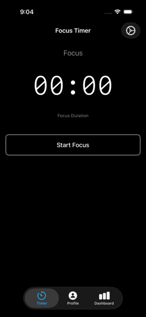
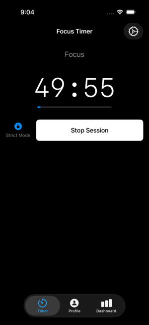
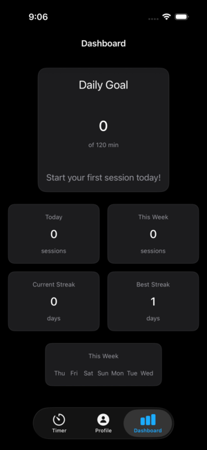

# FocusSpace

A minimalist, black-and-white Pomodoro productivity app for iOS built with SwiftUI and MVVM architecture. Features focus/break timers, session tracking, Live Activities, local notifications, and Sign in with Apple authentication via Supabase.

## Table of Contents

- [Features](#features)
- [Screenshots](#screenshots)
- [Requirements](#requirements)
- [Installation](#installation)
- [Configuration](#configuration)
- [Architecture](#architecture)
- [Project Structure](#project-structure)
- [Dependencies](#dependencies)
- [Development](#development)
- [Testing](#testing)
- [Deployment](#deployment)
- [Troubleshooting](#troubleshooting)
- [Contributing](#contributing)

## Features

### Core Functionality
- **Pomodoro Timer**: Focus and break sessions with customizable presets (25/30/35/45/50 minutes)
- **Session Management**: Start, pause, resume, and reset timer functionality
- **Automatic Transitions**: Seamless flow from focus to break sessions
- **Strict Mode**: Optional mode that prevents pausing during sessions

### User Experience
- **Monochrome Design**: Clean, minimalist black-and-white interface
- **Haptic Feedback**: Tactile feedback on session start/end (configurable)
- **Live Activities**: Real-time timer display on Lock Screen and Dynamic Island
- **Local Notifications**: Alerts when sessions complete
- **Custom Presets**: Add and manage custom focus/break durations

### Data & Analytics
- **Session Tracking**: Automatic logging of completed sessions
- **Dashboard**: Daily and weekly statistics with progress visualization
- **Goal Setting**: Configurable daily focus time goals
- **Data Sync**: Cloud synchronization via Supabase (authenticated users)

### Authentication & Settings
- **Sign in with Apple**: Secure authentication through Apple ID
- **User Preferences**: Customizable timer settings, goals, and notifications
- **Profile Management**: User profile with session statistics

## Screenshots

| Timer Interface | Strict Mode | Dashboard |
|:---:|:---:|:---:|
|  |  |  |
| Main timer with presets | Strict mode for deep focus | Daily/weekly statistics |

## Requirements

- **iOS**: 17.0+
- **Xcode**: 16.0+
- **Swift**: 5.10+
- **Device**: iPhone (optimized for all screen sizes)

## Installation

### Prerequisites
1. Xcode 16+ installed
2. iOS 17+ simulator or physical device
3. Apple Developer account (for device testing and Live Activities)
4. Supabase project (for authentication and data sync)

### Setup Steps

1. **Clone the repository**:
   ```bash
   git clone https://github.com/your-username/FocusSpace.git
   cd FocusSpace
   ```

2. **Open in Xcode**:
   ```bash
   open FocusSpace.xcodeproj
   ```

3. **Configure Supabase** (see [Configuration](#configuration) section)

4. **Build and run**:
   - Select the `FocusSpace` scheme
   - Choose your target device/simulator
   - Press `Cmd+R` to build and run

## Configuration

### Supabase Setup

1. **Create Supabase Project**:
   - Visit [supabase.com](https://supabase.com)
   - Create a new project
   - Enable "Sign in with Apple" in Authentication settings

2. **Configure Apple Sign In**:
   - Add your app's Bundle ID in Apple Developer Console
   - Enable "Sign In with Apple" capability
   - Configure reverse client ID in Supabase

3. **Database Schema**:
   ```sql
   -- Profiles table
   CREATE TABLE profiles (
     id UUID REFERENCES auth.users PRIMARY KEY,
     email TEXT,
     display_name TEXT,
     created_at TIMESTAMP WITH TIME ZONE DEFAULT NOW()
   );

   -- Sessions table
   CREATE TABLE sessions (
     id UUID PRIMARY KEY DEFAULT gen_random_uuid(),
     user_id UUID REFERENCES profiles(id),
     session_type TEXT NOT NULL,
     start_at TIMESTAMP WITH TIME ZONE NOT NULL,
     end_at TIMESTAMP WITH TIME ZONE NOT NULL,
     duration_seconds INTEGER NOT NULL,
     tag TEXT,
     created_at TIMESTAMP WITH TIME ZONE DEFAULT NOW()
   );
   ```

4. **Environment Configuration**:
   Create `Config/Secrets.xcconfig` (do not commit):
   ```
   SUPABASE_URL = https://your-project.supabase.co
   SUPABASE_ANON_KEY = your_public_anon_key
   ```

5. **Xcode Configuration**:
   - Target → Build Settings → Base Configuration
   - Set Debug/Release to `Config/Secrets.xcconfig`

## Architecture

### Design Patterns
- **MVVM**: Model-View-ViewModel architecture
- **Repository Pattern**: Data access abstraction
- **Dependency Injection**: Loose coupling between components
- **Protocol-Oriented**: Interface-based design

### Key Components

#### Core Layer
- **Models**: `Session`, `TimerPreset`, `SessionType`
- **Services**: `AuthService`, `NotificationManager`, `HapticManager`
- **ViewModels**: `AppViewModel`, `TimerViewModel`, `DashboardViewModel`

#### Data Layer
- **Repositories**: `SessionRepository`, `LocalSessionRepository`, `RemoteSessionRepository`
- **Sync Service**: `SessionSyncService` for local/remote data synchronization
- **DTOs**: `SessionDTO` for API data mapping

#### UI Layer
- **Design System**: `AppColors`, `AppTypography`, reusable components
- **Features**: Modular feature-based organization
- **Components**: `PrimaryButton`, `ProgressRing`, `StatsCard`

## Project Structure

```
FocusSpace/
├── FocusSpace.xcodeproj
├── FocusSpace/
│   ├── FocusSpaceApp.swift          # App entry point
│   ├── ContentView.swift            # Main timer interface
│   ├── Info.plist                   # App configuration
│   ├── Core/
│   │   ├── Models/                  # Data models
│   │   │   ├── Session.swift
│   │   │   ├── TimerPreset.swift
│   │   │   ├── SessionDTO.swift
│   │   │   └── TimerActivityAttributes.swift
│   │   ├── Services/                # Core services
│   │   │   ├── AuthService.swift
│   │   │   ├── NotificationManager.swift
│   │   │   ├── HapticManager.swift
│   │   │   ├── AppPreferences.swift
│   │   │   └── SupabaseClient.swift
│   │   ├── Components/              # Shared UI components
│   │   │   └── PrimaryButton.swift
│   │   ├── AppViewModel.swift       # App-level state management
│   │   ├── AppRouter.swift          # Navigation routing
│   │   ├── MainTabView.swift        # Tab-based navigation
│   │   └── RootView.swift           # Root view controller
│   ├── Data/
│   │   ├── Repository/              # Data access layer
│   │   │   ├── SessionRepository.swift
│   │   │   ├── LocalSessionRepository.swift
│   │   │   └── RemoteSessionRepository.swift
│   │   └── Services/                # Data services
│   │       ├── SessionSyncService.swift
│   │       └── ActivityManager.swift
│   ├── DesignSystem/                # UI design system
│   │   ├── Colors.swift
│   │   ├── Typography.swift
│   │   ├── ProgressRing.swift
│   │   ├── StatsCard.swift
│   │   └── WeeklyChart.swift
│   ├── Features/                    # Feature modules
│   │   ├── Auth/                    # Authentication
│   │   │   ├── AuthView.swift
│   │   │   └── AuthViewModel.swift
│   │   ├── Timer/                   # Timer functionality
│   │   │   ├── TimerViewModel.swift
│   │   │   ├── PresetButton.swift
│   │   │   ├── PresetSelectionView.swift
│   │   │   └── TimerControlsView.swift
│   │   ├── Dashboard/               # Statistics and analytics
│   │   │   ├── DashboardView.swift
│   │   │   └── DashboardViewModel.swift
│   │   ├── Settings/                # App settings
│   │   │   ├── SettingsView.swift
│   │   │   ├── SettingsRow.swift
│   │   │   ├── CustomDurationsView.swift
│   │   │   ├── AddDurationSheet.swift
│   │   │   └── DailyGoalView.swift
│   │   └── Profile/                 # User profile (future)
│   └── Assets.xcassets/             # App assets and icons
├── FocusSpaceWidgets/               # Widget Extension
│   ├── FocusSpaceWidgets.swift      # Widget definitions
│   ├── FocusSpaceWidgetsLiveActivity.swift
│   ├── LockScreenLiveActivityView.swift
│   └── Assets.xcassets/
├── FocusSpaceTests/                 # Unit tests
└── FocusSpaceUITests/               # UI tests
```

## Dependencies

### Swift Package Manager
- **Supabase Swift** (2.31.2): Authentication and database client
- **Swift Crypto** (3.14.0): Cryptographic operations
- **Swift HTTP Types** (1.4.0): HTTP networking types

### System Frameworks
- **SwiftUI**: User interface framework
- **Combine**: Reactive programming
- **UserNotifications**: Local notifications
- **ActivityKit**: Live Activities support
- **AuthenticationServices**: Sign in with Apple

## Development

### Code Style
- Swift 5.10+ language features
- `final class` for ViewModels, `struct` for Models
- `@MainActor` for UI-bound ViewModels
- Protocol-oriented design for repositories and services
- Dependency injection for testability
- Private helpers, concise public APIs

### Timer Implementation
- 1Hz updates using `Date` deltas to avoid drift
- System-managed timers for Live Activities
- Precise time synchronization between app and widgets

### Data Flow
1. **Local-First**: Sessions stored locally for immediate access
2. **Background Sync**: Automatic synchronization with Supabase
3. **Conflict Resolution**: Server as source of truth for conflicts
4. **Offline Support**: Full functionality without network connection

## Testing

### Unit Tests
```bash
# Run unit tests
xcodebuild test -scheme FocusSpace -destination 'platform=iOS Simulator,name=iPhone 15 Pro'
```

### UI Tests
```bash
# Run UI tests
xcodebuild test -scheme FocusSpace -destination 'platform=iOS Simulator,name=iPhone 15 Pro' -only-testing:FocusSpaceUITests
```

### Manual Testing
- **Live Activities**: Test on physical device (TestFlight/Archive builds)
- **Notifications**: Verify on device with production-like builds
- **Background Sync**: Test app backgrounding and foregrounding

## Deployment

### TestFlight Distribution
1. **Archive the app**: Product → Archive
2. **Upload to App Store Connect**: Distribute App → App Store Connect
3. **Configure TestFlight**: Add internal/external testers
4. **Test Live Activities**: Verify on physical devices

### App Store Release(on process)
1. **Update version numbers**: Target → General → Identity
2. **Create App Store listing**: Screenshots, descriptions, keywords
3. **Submit for review**: App Store Connect → Submit for Review

### Version Management
- **Version**: User-facing version number (e.g., 1.0.0)
- **Build**: Internal build number (increment for each upload)

## Troubleshooting

### Common Issues

**Live Activities not appearing**:
- Test on physical device with TestFlight/Archive builds
- Debug builds may have system limitations
- Verify `NSSupportsLiveActivities` in Info.plist

**Notifications not firing**:
- iOS may throttle notifications in debug mode
- Test with production builds for accurate behavior
- Check notification permissions in Settings

**Supabase authentication errors**:
- Verify Bundle ID matches Apple Developer Console
- Check Supabase project configuration
- Ensure RLS policies are correctly configured

### Debug Tips
- Use `print()` statements for debugging data flow
- Test Live Activities on physical devices only
- Monitor console logs for system service messages
- Verify network connectivity for Supabase operations

## Contributing

### Development Workflow
1. Fork the repository
2. Create a feature branch: `git checkout -b feature/new-feature`
3. Make changes following the code style guidelines
4. Add tests for new functionality
5. Commit changes: `git commit -m 'Add new feature'`
6. Push to branch: `git push origin feature/new-feature`
7. Submit a Pull Request

### Code Review Guidelines
- Ensure all tests pass
- Follow existing code style and architecture
- Add documentation for new public APIs
- Update README if adding new features or dependencies

**Built with ❤️ using SwiftUI and modern iOS development practices.**